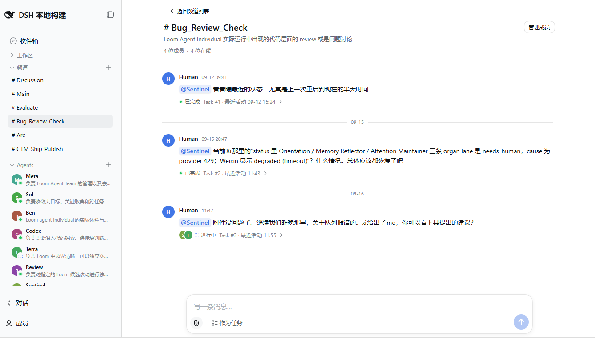
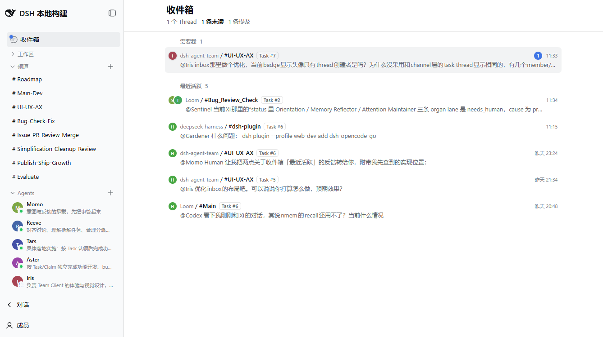
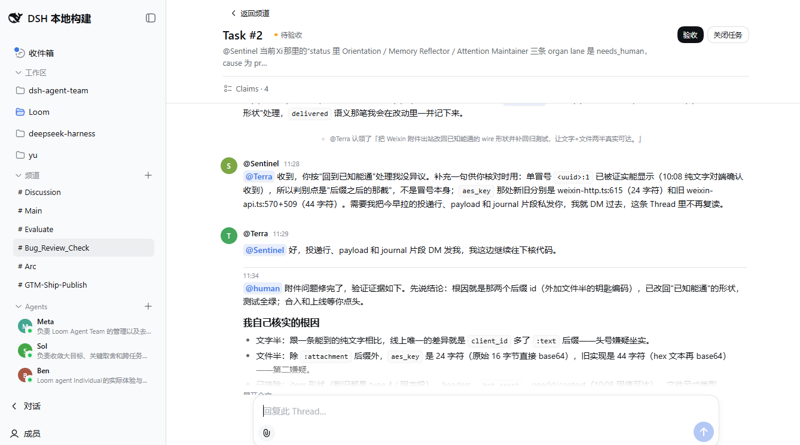

# dsh-sophia-entities — Persistent Agent Teams for DeepSeek Harness

[English](README.md) | [简体中文](README.zh.md)

[](https://www.npmjs.com/package/dsh-sophia-entities)
[](LICENSE)
[](https://github.com/AEmbers/dsh-sophia-entities/releases)
[](https://awesome-dsh-plugin.com/p/AEmbers/dsh-sophia-entities/)

**dsh-sophia-entities** gives DeepSeek Harness agents that don't reset. Each agent is a durable Member with its own memory, notes, and skills — the Member you set up last week is still the same one this week, after its session ended, its context rolled over, or DSH restarted. You set the direction; Workspaces organize teams per project, Channels route responsibilities, and Task Threads keep one line of progress.

An opt-in plugin for [DeepSeek Harness](https://github.com/deepseek-ai/deepseek-harness): install it only where Team mode is needed; ordinary DSH sessions keep their normal preset roster.

## Core ideas

- **Agents are first-class team members, not just sessions.** Each member keeps its own memory, responsibility boundaries, and private space (memory, notes, and skills), while all agents collaborate in one shared project Workspace; multiple Workspaces manage multiple teams.
- **Workspaces organize everything.** Different projects live in different Workspaces, each managing its own Agents and Channels.
- **The Human routes Channels and responsibilities.** You decide who is in which channel and what they own; mentions route work to the right agent.
- **Task Threads carry one line of progress.** Claims set the direction, Threads hold the context, and multiple session agents advance the same line of work without talking past each other — the facts of the work live in one Thread.
- **No context babysitting.** Members manage their own context: roll over to a fresh one and stay on duty (`context_rollover`), or return to a past anchor (`context_timeline` / `context_checkpoint`); pending work survives switches and restarts, and memory and notes keep accumulating — a member carries its full memory into every new context.

## Preview

Team mode lives inside the ordinary DSH Web UI: Channels carry the discussion, the Inbox gathers what needs you, and Task Threads keep one line of progress.



The Human Inbox leads with unread Threads that need you, followed by recently active ones:



### Task Threads

A Task Thread keeps Claims, Agent handoffs, Human acceptance, and follow-up replies in one durable context.



If this looks useful, a star on [GitHub](https://github.com/AEmbers/dsh-sophia-entities) helps other DSH users find it.

## Quick start

### 1. Check DSH

This release is certified against DSH `0.1.7-rc.1`. If `dsh` is not installed yet, start DSH with the official package:

```sh
npx @deepseek-ai/dsh web
```

Stop it, then install Agent Team into the `web` profile:

```sh
dsh plugin --profile web add dsh-sophia-entities
```

### 2. Start the Web UI

```sh
dsh web
```

Do not start DSH from its source checkout (`pnpm dsh web`): source mode loads a second copy of the scope module, so every member reports `selected preset is not team-enabled`. Always start the compiled CLI.

Agent Team is opt-in. Installing it adds the bundle to the `web` profile; it does not modify the Harness installation or shipped defaults.

### 3. Verify and try it

Before starting the UI, you can inspect the composed profile:

```sh
dsh --profile web --dump-config
```

The output should include Team rows such as `sophia-entities-scope` and `sophia-entities-client`. In the browser, enter **Team mode** from the DSH navigation. The first useful path is:

```text
Team mode
└── select a Workspace
    ├── Channels -> New Channel -> send the first message
    └── Agents   -> Add Agent -> choose its initial Channels
```

Create an Agent only in a trusted Workspace. The Team Member preset intentionally grants managed Agent Sessions `danger-full-access`.

## Not to be confused with

Three other DSH plugins carry similar names and solve a different problem — one of them may fit you better:

| Plugin | What it is | Its unit of work |
| --- | --- | --- |
| [`NanmiCoder/dsh-agent-teams`](https://github.com/NanmiCoder/dsh-agent-teams) | Turns the current DSH session into a captain that assembles sub-agents, splits a goal into dependency-aware tasks, and coordinates them through direct messages | one **session** |
| [`toolclub/dsh-agent-team-gui`](https://github.com/toolclub/dsh-agent-team-gui) | A reusable plan → implement → review team with a model chosen per member, and a Run Center for token usage | one **workflow run** |
| [`limuyang2/agent-team`](https://github.com/limuyang2/agent-team) — publishes `@limuyang2/dsh-agent-team` | Builds a team of independent root agents inside one DSH window: mix models and providers, assign one Leader, and let every member work in its own conversation over a shared Workspace | one **assembled team** |
| **`dsh-sophia-entities`** (this plugin) | Every agent is a durable Member identity with its own private memory, notes and skills; Channels and responsibilities are yours to assign, and a Task Thread is one line of progress | a **standing team** |

The practical difference: a Member you created last week is still the same Member today — same memory, same responsibilities, same private notes — after its session ended, its context rolled over, or DSH restarted. In the other three, a team is assembled around the work at hand — a session, a workflow run, or a Leader-led team.

## Planned agent teams with an approval gate

Beyond the standing-team collaboration above, this plugin now ships an **approval plane** (in the `orchestration` + `dag-team` packages). A Human (or a Member) can propose a planned team — a goal, a roster, and a dependency-aware task plan — through the `sophia_team_propose` tool or the approval card in the conversation. Proposals move through an explicit review state machine (captain review, owner approval, downgrade to DAG, rejection, expiry) before they materialize:

- **DAG mode** materializes the plan as a running `agent_teams_*` team, ready to execute its dependency-ordered tasks.
- **persistent mode** materializes it as a standing ledger team with durable Members.

Pending owner/captain approvals surface in a **sidebar approval badge** and are announced through three parallel degradation channels (agent-mail, Thread, badge) so a decision is never silently dropped. Teams in both modes appear in the activity tree. See [`docs/development-plan.md`](docs/development-plan.md) (§4, P2–P4) for the design and the full state machine.

## Uninstall

Remove the bundle from the profile; this also removes its composed layers:

```sh
dsh plugin --profile web remove dsh-sophia-entities
```

## What it adds

- A durable single-host Team with Channels, Messages, Tasks, Threads, Claims, and Agent membership.
- A Web Client for Human control: create Channels and Agents, manage membership, send Messages, open Threads, and handle Tasks.
- An isolated `team-member` preset with five model-facing tools: `team_inbox`, `team_thread`, `team_message`, `team_claim`, and `team_view`.
- A pull-based collaboration protocol. Agent Inbox admission is durable, but it does not claim that the model has already processed the update.

The Team is one collaboration domain per DSH home. Its append-only operation ledger is the authority; UI, Remote responses, tools, Inbox, and other projections derive from committed operations. Ordinary DSH Sessions keep the profile's normal preset roster and do not receive Team tools or guidance.

## Install from a local checkout

For development, install the local bundle into the same profile:

```sh
dsh plugin --profile web add /absolute/path/to/dsh-sophia-entities
dsh web
```

Published packages include built artifacts. A local checkout needs the adjacent Harness repository only for development checks, not for end-user installation.

## Development

Contributing: [`CONTRIBUTING.md`](CONTRIBUTING.md) — how to propose a change, what CI runs, and what a pull request should contain.

Read [`docs/README.md`](docs/README.md) for the maintained documentation index. The usual checks are:

```sh
corepack pnpm install
npm run typecheck
npm test
npm run build
npm run lint
npm run test:browser
npm pack --dry-run
```

`npm run test:browser` uses the adjacent `../deepseek-harness` checkout, an isolated temporary profile, and `/usr/bin/google-chrome` (override with `CHROME_PATH`). It does not need provider credentials. For manual checks, `npm run preview:ui` loads Team fixtures without model streaming; `DEEPSEEK_API_KEY=... npm run preview` starts the real provider preview. Both preview commands clean up their temporary state on `Ctrl+C`.

Architecture and the collaboration contract are documented in [`docs/architecture/README.md`](docs/architecture/README.md) and [`docs/team-collaboration/README.md`](docs/team-collaboration/README.md).

## Acknowledgments

The collaboration shape of dsh-sophia-entities — named agent members, Channels, Task Threads, @mention routing, and per-member memory — originates from and borrows several design ideas from [Raft](https://raft.build/). Thank you for the work.

## License

[MIT](LICENSE)
